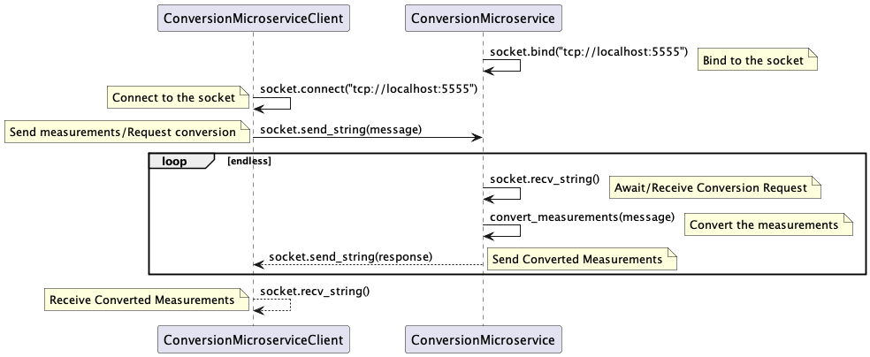

# CS361 - Microservice A (Conversion Microservice) Communication Contract - William Franklin

## A. Clear instructions for how to programmatically REQUEST data from the microservice you implemented. Include an example call.

1. First, you need to install the necessary libraries. If you haven't already, you can install them using pip:

`pip install zmq`

2. Here is an example of how to programmatically request data from Microservice A:

```
import zmq
import json

# Initialize a ZeroMQ context
context = zmq.Context()

# Create a REQ socket
socket = context.socket(zmq.REQ)

# Connect the socket to the server's address
socket.connect("tcp://localhost:5555")

# Define a dictionary of measurements
measurements = {
    "flour": "200g",
    "sugar": "100g",
    "butter": "50g"
}

# Send the measurements to the server
message = json.dumps(measurements)
socket.send_string(message)
```

This script initializes a ZeroMQ context, creates a REQ socket, and connects to the server at localhost on port 5555. It then sends a JSON-encoded dictionary of measurements to the server and waits for a response. 

Note that you need to define a dictionary that contains your ingredients and amounts to convert, then send that. The request to the conversion microservice is expected to be a JSON-encoded dictionary of measurements to be converted from one measurement to another.

## B. Clear instructions for how to programmatically RECEIVE data from the microservice you implemented.

Here's an example of how to receive data from the microservice once the original data has been sent:

```
# Wait for the server's response
response = socket.recv_string()
converted_measurements = json.loads(response)

print("Received response:", converted_measurements)
```

Note that the response from the conversion microservice is a JSON-encoded dictionary of measurements that have been converted from one measurement to another.

## C. UML sequence diagram showing how requesting and receiving data works. Make it detailed enough that your teammate (and your grader) will understand.

